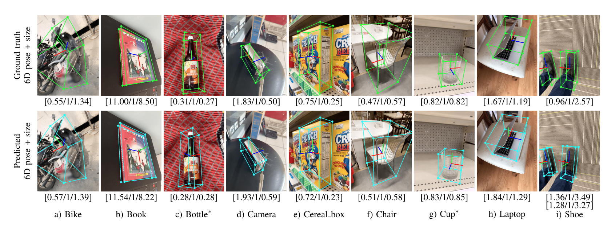

# CenterPose



## Installation

The code was tested on Ubuntu 22.04, Python 3.10 and [PyTorch]((http://pytorch.org/)) 1.13.1 and cuda 11.7. NVIDIA GPUs are needed for both training and testing. 

---

1. Clone this repo:

    ~~~
    mkdir -p center_pose_ws/src/center_pose_ros2/scripts/
    cd ~/center_pose_ws/src/center_pose_ros2/scripts/
    git clone https://github.com/ArghyaChatterjee/CenterPose.git
    ~~~

2. Compile the deformable convolutional layer

    ~~~
    cd ~/center_pose_ws/src/center_pose_ros2/scripts/CenterPose/src/lib/models/networks/DCNv2
    ./make.sh
    ~~~

3. Download [CenterPose pre-trained models](https://drive.google.com/drive/folders/16HbCnUlCaPcTg4opHP_wQNPsWouUlVZe?usp=sharing) and move all the `.pth` files to `~/center_pose_ws/src/center_pose_ros2/scripts/CenterPose/models/`.  Similarly, download our [CenterPoseTrack pre-trained models](https://drive.google.com/drive/folders/1zOryfHI7ab2Qsyg3rs-zP3ViblknfzGy?usp=sharing) and move all the `.pth` files to `~/center_pose_ws/src/center_pose_ros2/scripts/CenterPose/models/CenterPoseTrack/`. 9 categories are provided currently: bike, book, bottle, camera, cereal_box, chair, cup, laptop, and shoe. 

4. Prepare training/testing data

    Save all the training/testing data under `~/center_pose_ws/src/center_pose_ros2/scripts/CenterPose/data/`.

    For the [Objectron](https://github.com/google-research-datasets/Objectron) dataset, we created our own data pre-processor to extract the data for training/testing. Refer to the [data directory](data/README.md) for more details.

## Demo

We provide supporting demos for image, videos, webcam, and image folders. See `~/center_pose_ws/src/center_pose_ros2/scripts/CenterPose/images/CenterPose`

For category-level 6-DoF object estimation on images/video/image folders, run:

```
cd ~/center_pose_ws/src/center_pose_ros2/scripts/CenterPose/src
python demo.py --demo /path/to/image/or/folder/or/video --arch dlav1_34 --load_model ../path/to/model
```

Similarly, for category-level 6-DoF object tracking, run:
```
cd ~/center_pose_ws/src/center_pose_ros2/scripts/CenterPose/src
python demo.py --demo /path/to/folder/or/video --arch dla_34 --load_model ../path/to/model --tracking_task
```

You can also enable `--debug 2` to display more intermediate outputs or `--debug 4` to save all the intermediate and final outputs.

For the webcam demo (You may want to specify the camera intrinsics via --cam_intrinsic), run:
```
cd ~/center_pose_ws/src/center_pose_ros2/scripts/CenterPose/src
python demo.py --demo webcam --arch dlav1_34 --load_model ../path/to/model
```

Similarly, for tracking, run:
```
cd ~/center_pose_ws/src/center_pose_ros2/scripts/CenterPose/src
python demo.py --demo webcam --arch dla_34 --load_model ../path/to/model --tracking_task
```

## Training

We follow the approach of [CenterNet](https://github.com/xingyizhou/CenterNet/blob/master/experiments/ctdet_coco_dla_1x.sh) for training the DLA network, reducing the learning rate by 10x after epoch 90 and 120, and stopping after 140 epochs. Similarly, for CenterPoseTrack, we train the DLA network, reducing the learning rate by 10x after epoch 6 and 10, and stopping after 15 epochs.

For debug purposes, you can put all the local training params in the `~/center_pose_ws/src/center_pose_ros2/scripts/CenterPose/src/main_CenterPose.py` script. Similarly, CenterPoseTrack can follow `~/center_pose_ws/src/center_pose_ros2/scripts/CenterPose/src/main_CenterPoseTrack.py` script. You can also use the command line instead. More options are in `~/center_pose_ws/src/center_pose_ros2/scripts/CenterPose/src/lib/opts.py`.

To start a new training job, simply do the following, which will use default parameter settings:
```
cd ~/center_pose_ws/src/center_pose_ros2/scripts/CenterPose/src
python main_CenterPose.py
```

The result will be saved in `~/center_pose_ws/src/center_pose_ros2/scripts/CenterPose/exp/object_pose/$dataset_$category_$arch_$time` ,e.g., `objectron_bike_dlav1_34_2021-02-27-15-33`

You could then use tensorboard to visualize the training process via
```
cd $path/to/folder
tensorboard --logdir=logs --host=XX.XX.XX.XX
```

## Evaluation

We evaluate our method on the [Objectron](https://github.com/google-research-datasets/Objectron) dataset, please refer to the [objectron_eval directory](src/tools/objectron_eval/README.md) for more details.

